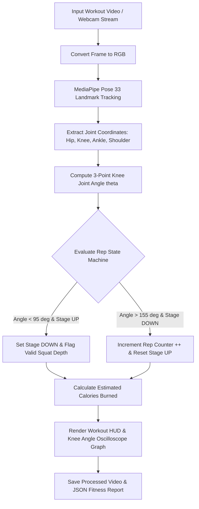

<div align="center">

# 🏋️ AI Fitness Rep Counter & Pose Detector

### *Day 15 — 30-Day Computer Vision & Deep Learning Challenge*

[](https://www.python.org/)
[](https://mediapipe.dev/)
[](https://opencv.org/)
[](LICENSE)
[](https://github.com/manasha1232)

*Real-time AI Fitness Coach and Repetition Counter using MediaPipe Pose 33 3D body keypoints, 3-point trigonometric joint angle geometry, workout state machines, form quality feedback, and real-time knee angle oscilloscope graphs.*

---

</div>

## 📌 Overview

The **AI Fitness Rep Counter & Pose Detector** turns a standard camera stream into a personal virtual fitness trainer. By tracking 33 3D skeletal body landmarks (Hip, Knee, Ankle, Shoulder), computing joint angles in real time, and maintaining exercise state transitions (`UP` $\leftrightarrow$ `DOWN`), the engine automatically counts exercise repetitions (Squats, Push-ups, Bicep Curls), evaluates squat depth form quality (`PERFECT SQUAT` vs `GO LOWER`), and estimates calories burned ($\text{kcal}$).

### 🎯 Key Capabilities
- **MediaPipe Pose 33 Keypoint Tracking**: Tracks full-body 3D anatomical joints in real time with high landmark precision.
- **Trigonometric Joint Angle Engine**: Computes exact interior 3-point joint angles:
  $$\theta = \arccos\left(\frac{\vec{BA} \cdot \vec{BC}}{\|\vec{BA}\| \|\vec{BC}\|}\right) \times \frac{180}{\pi}$$
- **Automated Rep Counter State Machine**: Detects state transitions (`UP` $> 155^\circ \to \text{DOWN} < 95^\circ \to \text{UP}$) to count valid reps.
- **Squat Form & Depth Analysis**: Evaluates whether the user reached parallel depth ($< 95^\circ$) and provides live audio-visual feedback.
- **Real-Time Angle Oscilloscope Graph**: Plots live knee joint angle waveforms over time alongside threshold limiters.
- **JSON Workout Telemetry Log Export**: Exports structured JSON logs detailing total completed reps, form scores, calories burned ($\text{kcal}$), and output video paths.

---

## 🏗️ System Architecture & Processing Pipeline



---

## 📁 Repository Structure

```text
ai_fitness_rep_counter/
├── rep_counter.py            # Core fitness rep counter engine & HUD renderer
├── generate_demo_workout.py  # Synthetic squat workout video generator
├── requirements.txt          # Dependency declarations (opencv-python, mediapipe, numpy)
├── README.md                 # Project documentation
├── input/                    # Input workout video dataset
│   └── sample_workout_squats.mp4
└── output/                   # Processed output video & fitness telemetry report
    ├── sample_workout_squats_rep_counter_output.mp4
    └── sample_workout_squats_fitness_report.json
```

---

## ⚡ Quickstart & Installation

### 1. Install Dependencies
```bash
pip install -r requirements.txt
```

### 2. Generate Synthetic Workout Video
```bash
python generate_demo_workout.py
```

### 3. Run AI Fitness Rep Counter
```bash
python rep_counter.py --input input/sample_workout_squats.mp4 --output output
```

### 4. Live Webcam Stream Workout Mode
```bash
python rep_counter.py --input camera
```

---

## 📊 Workout Telemetry Specification

```json
{
    "video_source": "sample_workout_squats",
    "total_frames_processed": 180,
    "total_time_seconds": 5.94,
    "average_fps": 30.3,
    "exercise": "squat",
    "total_repetition_count": 4,
    "estimated_calories_kcal": 1.28,
    "output_video": "output/sample_workout_squats_rep_counter_output.mp4"
}
```

---

## 👤 Author & Challenge Context

- **Challenge**: Day 15 of [30-Day Computer Vision & Deep Learning Challenge](https://github.com/manasha1232/30-Day-Computer-Vision-Challenge)
- **Author**: [@manasha1232](https://github.com/manasha1232)
- **License**: MIT License
